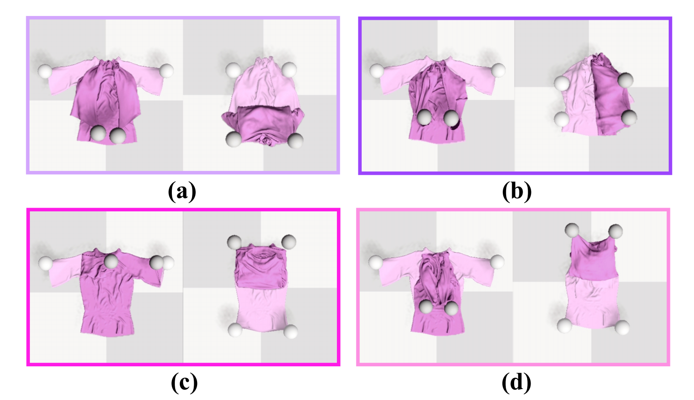

# Data Collection


## Usage
You can start single collecting process by following command
```angular2html
python cross_deform.py
```
However, Pyflex has some error so you can not initialize several environment at the same time

You can start multi-thread collecting process by following command
```angular2html
python cross_deform_multi.py
```