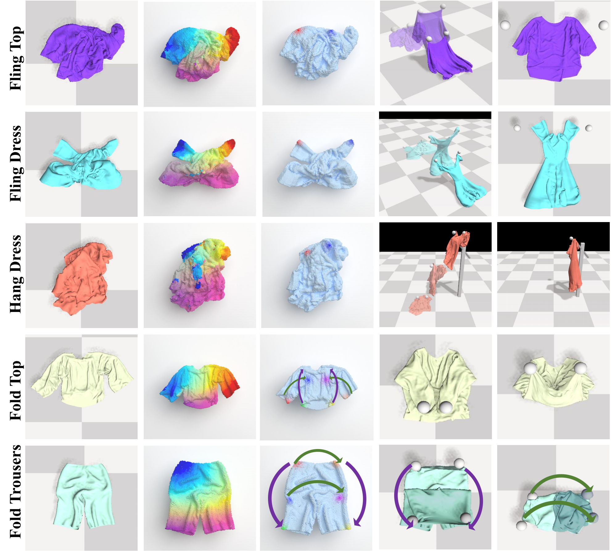

# The simulation environment for UniGarmentManip



## Introduction
We import [Cloth3d](https://hbertiche.github.io/CLOTH3D/) mesh into pyflex environment to simulate the garment manipulation tasks. The simulator is based on [PyFlex](https://github.com/YunzhuLi/PyFleX).

## Installation
1. Install Nvidia Driver <br>
We recommend driver version = 525.60.11
2. Install Cuda 9.2 <br>
<font color=red> Notion that you must install cuda 9.2, otherwise you will encounter some errors.<br> </font>
You can download and install cuda 9.2 from [here](https://developer.nvidia.com/cuda-92-download-archive) <br>
In the installation process, if you encounter error about gcc version, you can switch to a lower version of gcc using the following command
```bash
sudo apt-get install gcc-7 g++-7
sudo rm -rf /usr/bin/gcc /usr/bin/g++
sudo ln -s /usr/bin/gcc-7 /usr/bin/gcc
sudo ln -s /usr/bin/g++-7 /usr/bin/g++
```
3. Install pybind11 <br>
Although pybind11 can be installed using anaconda, we do recommand you to install it from source code.
You can install pybind11 using the following command
```bash
git clone https://github.com/pybind/pybind11.git
cd pybind11
mkdir build
cd build
cmake ..
make check -j 8
sudo make install
```
note that you should install cmake and pytest before you install pybind11.
```bash
sudo apt-get install cmake
pip install pytest
```

4. Install Pyflex <br>
Now you are ready to install pyflex. The building command is simple.
```bash
. ./prepare.sh
. ./compile.sh
```
If all is well, you can find pyflex.cpython-38-x86_64-linux-gnu.so in the garmentgym/Pyflex/bindings/build

5. Verification <br>
You can verify the installation by running the following command
```bash
python test.py
```

### Usage
#### Init the environment
You need to prepare the environment in terminal by using the following command
```bash
. ./prepare.sh
```
#### Code structure
The code structure are as followed
```
    garmentgym/             # The garment manipulation simulator
    garmentgym/base         # You can change the parameters of the simulation environment here
    garmentgym/envs         # The code for garment manipulation tasks environment
    garmentgym/utils        # The code for garmentgym utility functions
    Pyflex/                 # The pyflex simulator
    Pyflex/bindings         # The pyflex bindings in import mesh
``` 